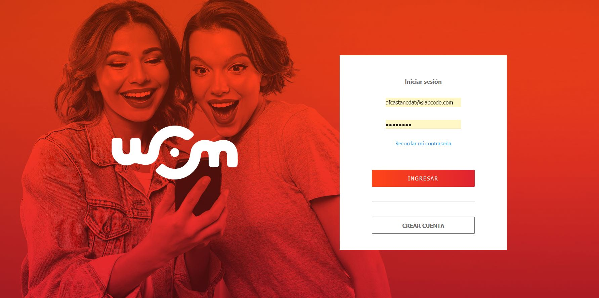
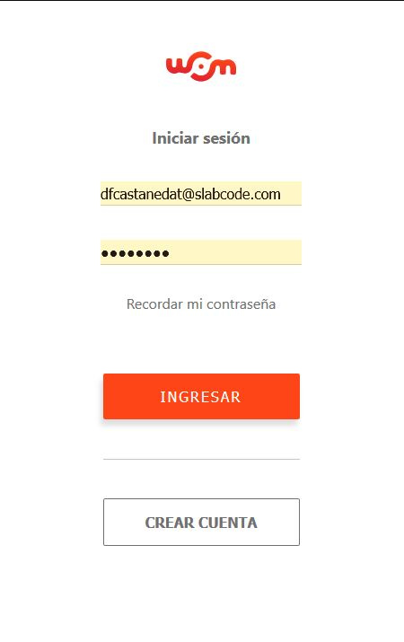

# React SPA

> This project is a single page application built with React and Redux, All data used in the app was retrieved from the 
> Provided API and it is stored in the Redux store, you can filter by categories using the top Nav bar also you can 
> log in and log out using the token generated for the API.
## Built With

- React
- Redux.
- axios
- redux-thunk.

## Demo Screenshots

## Live Demo

[Live version](https://nifty-bartik-e35865.netlify.app/)

## Prerequisites

node: v12.19.0
## Getting Started
To get a local copy up and running follow these simple example steps.

- Open a terminal or command prompt interface on your PC.
- Clone the repo with: `git clone https://github.com/kenderb/React-tech-red.git`
- On the terminal navigate to the project directory using `cd React-tech-red/`

## 📝 Setup

1. On the terminal navigate to the project directory using `cd React-tech-red/`.
2. Install dependencies using: `npm install`.
2. Run a server using: `npm start`.
3. Open `http://localhost:3000/` in your browser or open the index.html on your browser.

## Authors

👤 **Kender Bolivar**

- GitHub: [@kenderb](https://github.com/ken)
- Twitter: [@KBTarts](https://twitter.com/KBTarts )
- LinkedIn: [KenderBolivar](https://www.linkedin.com/in/kender-bolivar-1736086b/ )

